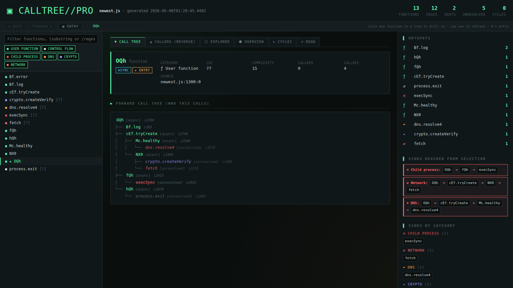

# calltree-pro

> Static call-graph analyzer for JavaScript/TypeScript — built for reverse-engineering obfuscated code.

`calltree-pro` parses your source with Babel, builds a full call graph, classifies suspicious API touchpoints (network, DNS, child-process, crypto, dynamic exec, …), and emits **six different reports in one shot** — including an interactive disassembler-style HTML view.

```
┌─────────────────────────────────────────
│ ROOT FUNCTIONS
└─────────────────────────────────────────

  OQh [async]

┌─────────────────────────────────────────
│ CALL TREES
└─────────────────────────────────────────

OQh [async]
├── cEf.tryCreate [async]
│   ├── Mc.healthy [async]
│   │   └── dns.resolve4 [unresolved]
│   └── NX0 [async]
│       ├── Buffer.from [unresolved]
│       └── crypto.createVerify [unresolved]
├── fQh [async]
│   ├── K0f.execute [async]
│   │   └── execSync [unresolved]
│   └── vEf.execute [async]
│       ├── exec [unresolved]
│       └── fetch [unresolved]
└── hQh [async]
    └── process.exit [unresolved]
```

## Why

You drop a 6,000-line minified blob from `obfuscator.io` (or a suspicious npm package) into the tool and it tells you:

- Which entry points reach `child_process`, `fetch`, `dns`, `eval`, etc., **and the shortest call chain that gets there**
- What the symbol-mangled functions (`OQh`, `cEf.tryCreate`, `_0x11fbfb`) are connected to
- Hotspots — which functions get called the most (often utilities the obfuscator references everywhere)
- Cycles, dead code, async/generator/private flags, complexity, LOC, fan-in / fan-out
- All callees that have **no definition** in your source — registered as `[unresolved]` *filler* stubs so the call tree stays connected even when names come from string-array indirection

## Install

```bash
npm install
```

Requires Node ≥ 14.

## One command, all reports

```bash
node src/cli.js examples/newest.js
```

That's it. The tool generates a `newest_report/` directory (named after the input file) with all reports:

| File | What it is |
|---|---|
| `html.html` | **Interactive disassembler view.** Open this first. Searchable sidebar, IDA-style explorer, forward/back navigation, breadcrumb, severity-colored sinks. |
| `report.md` | Full markdown audit. Box-drawing call trees, sinks tables, danger paths, function metrics, unresolved callees with line numbers. |
| `tree.txt` | Plain-text call tree (no ANSI codes, diff-friendly). |
| `json.json` | Machine-readable structured dump. |
| `graph.dot` | Graphviz DOT — top-down, capped at 200 nodes, anchored on the auto-detected primary entry. |
| `graph.<entry>.dot` | Focused 80-node, 3-hop neighborhood around the primary entry — readable instead of a 20K-pixel mega-graph. |
| `graph.svg` | Auto-rendered DOT → SVG (only present if `dot` from graphviz is on PATH). |
| `graph.mermaid.md` | Mermaid flowchart for GitHub markdown. |
| `graph.mmd` | Raw Mermaid source, ready for `mmdc -i graph.mmd -o graph.svg`. |
| `graph.mermaid.svg` | Auto-rendered Mermaid → SVG (only present if `mmdc` from `@mermaid-js/mermaid-cli` is on PATH). |
| `INDEX.md` | Auto-generated index linking everything together. |

The same colored tree streams to your terminal as it runs. After completion, the CLI prints install hints for `graphviz` and `@mermaid-js/mermaid-cli` if either is missing.

## Primary entry detection

Obfuscated bundles often have 60+ "anonymous" roots and a handful of real ones. The tool auto-identifies the **primary entry** by picking the non-anonymous, non-toplevel root with the largest reachable subgraph — usually the orchestrator (e.g. `OQh` in the user's malware sample). It's marked with a `★` in the HTML sidebar, gets an `★ entry` badge in the function header, anchors the focused dot/mermaid graphs, and is auto-selected on page load.

## Defaults

The "all in one shot" run uses analyst-friendly defaults — everything on, no filters:

| Default | Why |
|---|---|
| `--include-builtins` ON  | You want to see calls to `fetch`, `execSync`, `Buffer.from`, etc. — those are the dangerous ones |
| `--include-anonymous` ON | Obfuscated code is full of anonymous fns — hiding them hides the graph |
| `--detect-cycles` ON     | Free, useful |
| `--detect-dead` ON       | Helps spot leftover scaffolding |
| `--hotspots 15`          | Top 15 most-called functions |
| `--color` ON             | Terminal output is colored by sink category |
| no `-r` / `-d` / `-i`    | Full enumeration; no root filter, no depth cap, no ignore globs beyond `node_modules` |

Override any of them with `--no-builtins`, `--no-color`, `-r OQh`, `-d 5`, `-i '**/test/**'`, etc.

## The disassembler HTML view



Single-file, no external deps (just Google Fonts CDN). Drop the `html.html` anywhere and double-click.

- **Navbar (top):** `◄ back`, `forward ►`, `▣ entry` buttons + breadcrumb. Click any function in any tree to drill in; click back to return. `Alt+←` / `Alt+→` are shortcuts. `H` jumps to the primary entry. `/` focuses the search.
- **Left sidebar:** every function in the project, with a category-colored dot. The primary entry is starred (`★`). Type to filter (substring or `/regex/`). Click a category chip to toggle.
- **Center tabs:**
  - **Call tree** — clickable forward tree (who *this* calls), with box-drawing connectors, async/ctor/unresolved badges, sink-category coloring, and **line numbers** next to each function (e.g. `dns.resolve4 [unresolved] L2570` shows the call site for unresolved fillers).
  - **Callers (reverse)** — same UI, but who *calls this*.
  - **Explorer** — IDA-style 3-column xrefs view: callers │ selected │ callees. Each card shows the call-site line (`@ L1340,L1350`). Dangerous categories get a red left border.
  - **Overview / Cycles / Dead** — project-wide views.
- **Right panel:**
  - Hotspots with bar chart
  - **Sinks reached from the current selection** — for each dangerous category (`dynamic_exec`, `child_process`, `network`, `dns`), the shortest call chain from your selection to a sink, as clickable pills
  - All sinks grouped by category

## Source line numbers everywhere

Every node in every tree shows its line in the source. For **defined** functions that's where the body starts; for **unresolved fillers** (the obfuscator.io case where the parser only sees the call) the line is the call-site, captured from the edge — so `dns.resolve4 L2570` tells you exactly where in `newest.js` to look. The function header also lists up to 4 call sites for fillers (`called from: newest.js:2570:8; newest.js:2890:12; ...`).

## Sinks and categories

Every callee is classified into a category:

| Category | What it catches |
|---|---|
| `dynamic_exec` | `eval`, `new Function`, `vm.*` |
| `child_process` | `exec`, `execSync`, `spawn`, `fork`, `child_process.*` |
| `network` | `fetch`, `axios.*`, `http.get/request/post`, `.send`, `WebSocket` |
| `dns` | `dns.*`, `new Resolver` |
| `fs` | `fs.read*`, `fs.write*`, `createWriteStream`, … |
| `env` | `process.env`, `os.homedir`, `os.userInfo`, `os.networkInterfaces`, `process.argv`, … |
| `crypto` | `crypto.create*`, `randomBytes`, `sign`, `verify` |
| `encoding` | `Buffer.from`, `atob`, `btoa` |
| `fingerprint` | `navigator.*` |
| `dom` / `scheduling` / `error` / `control` | (lower-priority categories) |

Every category has a color, an icon, and a severity (`high`/`medium`/`low`). The HTML view colors function names by category; the markdown report tags every entry with its category.

Add or override rules by editing `src/utils/sinks.js`.

## Filler functions (the obfuscator.io case)

When a function gets called but has no definition in the source — extremely common with `obfuscator.io` output, where names come from a runtime string-array lookup the parser can't follow — `calltree-pro` automatically registers a **filler** stub:

```text
└── dns.resolve4  [unresolved,dns]
```

Filler stubs:

- Show up in the call tree, sidebar, and sinks tables
- Get classified by the same regex rules (so `fetch`, `execSync`, etc. are still caught)
- Are tagged `unresolved` everywhere they appear
- Have a `[?]` marker in the HTML sidebar
- Get a dedicated **"Unresolved callees"** table in the markdown report, sorted by caller count

The point: your call graph never has dangling edges, even on heavily obfuscated code where most names are missing.

## Graph rendering (DOT and Mermaid)

A naïve dump of every node and edge produces a 20K-pixel SVG that's unreadable. The tool fights this two ways:

1. **Anchor on the primary entry.** All graph output is BFS-bounded around the auto-detected entry function. Default cap is 200 nodes for `graph.dot`, 80 nodes for the focused `graph.<entry>.dot`, 120 for mermaid. Pass `--focus <name>` to anchor on something else, or `--no-builtins` etc. to filter.
2. **Auto-render.** If `dot` (graphviz) and/or `mmdc` (`@mermaid-js/mermaid-cli`) are on PATH, the tool runs them and produces `graph.svg` and `graph.mermaid.svg` directly. If they're missing, it prints install hints:
    ```bash
    apt install graphviz             # debian / kali / ubuntu
    brew install graphviz            # macOS
    npm i -g @mermaid-js/mermaid-cli # mermaid renderer
    ```

The DOT output is top-down (`rankdir="TB"`), with the primary entry highlighted in phosphor green (`penwidth=3`), unresolved fillers as dashed boxes, and edges into dangerous sinks colored by category (red for `child_process`/`dynamic_exec`, magenta for `network`/`dns`).

## Single-format mode

Want only one report? Use `--format`:

```bash
node src/cli.js examples/newest.js --format dot -o graph.dot
node src/cli.js examples/newest.js --format html -o report.html
node src/cli.js examples/newest.js --format report -o audit.md
```

When `--format` is given the output dir is *not* created — only the requested file is emitted.

## Configuration file

Drop a `.calltreerc.json` in the project root to set defaults:

```json
{
  "includeBuiltins": true,
  "includeAnonymous": true,
  "detectCycles": true,
  "detectDead": true,
  "hotspots": 25,
  "ignore": ["**/node_modules/**", "**/dist/**", "**/.next/**"]
}
```

CLI flags override the rc file.

## Programmatic API

```js
const { analyzeProject } = require("calltree-pro");
const { formatReport } = require("calltree-pro/src/formatters/report");

const result = await analyzeProject(["./src/**/*.js"], {
  includeBuiltins: true,
  detectCycles: true,
});

console.log(formatReport(result, { hotspots: 15 }));
console.log(result.graph.shortestPathToCategory("OQh", ["network", "child_process"]));
console.log(result.graph.byCategory().child_process);
```

`result.graph` is a `CallGraph` with these analysis methods:

| Method | Returns |
|---|---|
| `roots()` | Functions with no callers (entry points) |
| `cycles()` | Tarjan SCC cycle detection |
| `deadFunctions()` | Defined but never called |
| `hotspots(n)` | Top-N most-called functions with counts |
| `byCategory()` | `{ [category]: FunctionInfo[] }` |
| `shortestPathToCategory(from, cats)` | BFS path to nearest dangerous sink |
| `reachable(from)` | Set of all transitively-reachable function names |
| `fanInOut()` | `Map<name, { fanIn, fanOut }>` |

## Project layout

```
src/
  cli.js                 # commander entry point + all-formats orchestration
  index.js               # analyzeProject (file walking + Babel parsing)
  analyzers/
    file.js              # Babel traversal — qualified names, locations, complexity
    graph.js             # CallGraph + cycles, dead, hotspots, fillers, sinks
  formatters/
    tree.js              # Box-drawing terminal output
    report.js            # Markdown report (this is what you commit)
    html.js              # Single-file interactive disassembler HTML
    json.js / dot.js / mermaid.js
  utils/
    sinks.js             # Sink classification rules + category metadata
    constants.js
    parser-config.js
examples/
test/
```

## License

MIT.
