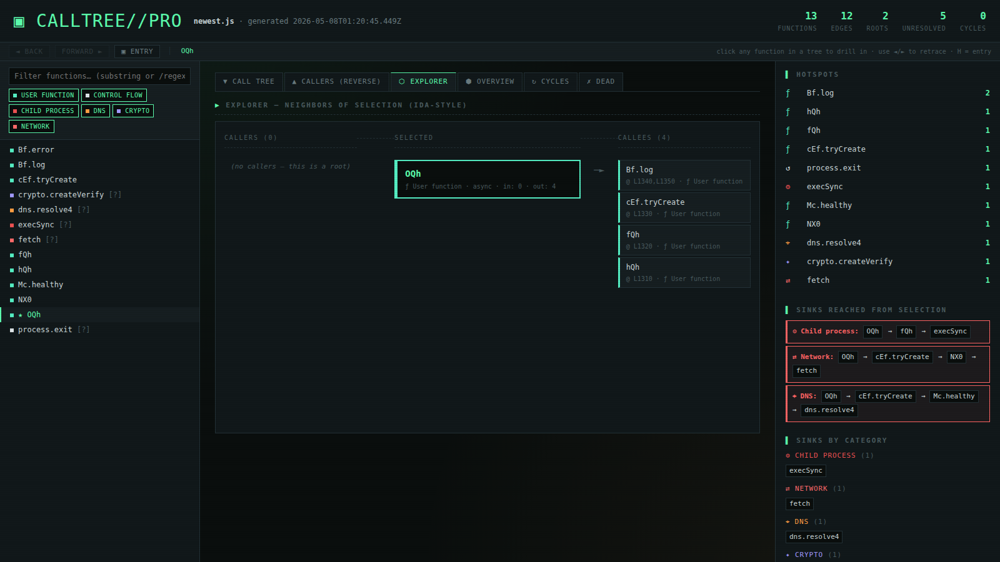

---

# 🧬 Calltree Pro

**Static call-graph analyzer for JavaScript / TypeScript — built for reverse-engineering obfuscated code.**
One command produces an interactive HTML disassembler view, a markdown audit, DOT/Mermaid graphs, JSON, and auto-rendered SVGs — all in a single output directory.
Designed for analysts looking at `obfuscator.io` output, suspicious npm packages, and minified malware bundles.


---

## 📑 Table of Contents

- [🧬 Calltree Pro](#-calltree-pro)
- [📑 Table of Contents](#-table-of-contents)
- [🚀 Features](#-features)
- [📦 Requirements](#-requirements)
- [⚙️ Installation](#%EF%B8%8F-installation)
- [🚀 Usage](#-usage)
  * [Basic Usage](#basic-usage)
  * [Single-format Mode](#single-format-mode)
  * [Custom Output Directory](#custom-output-directory)
  * [Anchor on a Specific Function](#anchor-on-a-specific-function)
- [📁 Output Overview](#-output-overview)
  * [What Each File Contains](#what-each-file-contains)
  * [Console Output Example](#console-output-example)
  * [Box-drawing Tree Example](#box-drawing-tree-example)
- [🖥️ The HTML Disassembler View](#%EF%B8%8F-the-html-disassembler-view)
  * [Forward / Back Navigation](#forward--back-navigation)
  * [IDA-style Explorer](#ida-style-explorer)
  * [Source Line Annotations](#source-line-annotations)
- [⚙️ Configuration](#%EF%B8%8F-configuration)
  * [Defaults](#defaults)
  * [Configuration File](#configuration-file)
- [⚠️ Sinks & Severity Categories](#%EF%B8%8F-sinks--severity-categories)
- [🧩 Filler Functions (the obfuscator.io case)](#-filler-functions-the-obfuscatorio-case)
- [📊 Graph Rendering (DOT & Mermaid)](#-graph-rendering-dot--mermaid)
- [🧠 Internals & How It Works](#-internals--how-it-works)
- [🔌 Programmatic API](#-programmatic-api)
- [🔍 How It Differs from `madge` / `dependency-cruiser`](#-how-it-differs-from-madge--dependency-cruiser)
- [📂 Project Layout](#-project-layout)
- [🤝 Contributing](#-contributing)
- [⚠️ Disclaimer](#%EF%B8%8F-disclaimer)
- [📄 License](#-license)
- [🙏 Credits](#-credits)
- [⭐ Support](#-support)
- [🔗 Links](#-links)

---

## 🚀 Features

- **One command, all reports** — `node src/cli.js file.js` produces a `<filename>_report/` directory with HTML, markdown, JSON, DOT, Mermaid, and auto-rendered SVGs
- **Interactive HTML disassembler** — IDA-style xrefs explorer, forward/back navigation, breadcrumb, severity-colored sinks, searchable sidebar, keyboard shortcuts
- **Auto-detected entry points** — picks the orchestrator function automatically (e.g. `OQh` in obfuscated bundles) by scoring roots by reachable subgraph size
- **Sink classification** — every callee is tagged with a category (`network`, `dns`, `child_process`, `crypto`, `dynamic_exec`, `fs`, `env`, …) and severity
- **Shortest path to danger** — for every entry point, BFS-computes the shortest call chain to each dangerous sink
- **Filler functions for unresolved calls** — when a name has no definition (common with `obfuscator.io` string-array indirection), it's registered as a stub with the **call-site line number** so the tree stays connected
- **Source-line annotations everywhere** — `dns.resolve4 [unresolved] L2570` tells you exactly where in the source to look
- **Box-drawing ASCII trees** — proper `├──`, `└──`, `│`, `↩`, `↻`, `█` connectors in both terminal and markdown
- **Cycle detection** (Tarjan SCC), dead-code detection, hotspots with bar charts, fan-in / fan-out, complexity, LOC
- **Bounded graph output** — DOT and Mermaid are BFS-anchored on the primary entry and capped (200 / 80 / 120 nodes) to avoid the 20K-pixel mega-graph problem
- **Auto-render to SVG** — calls `dot` (graphviz) and `mmdc` (mermaid-cli) automatically if installed
- **Filtering & search** — substring or `/regex/` filter in the HTML sidebar, category chip toggles, `Alt+←`/`Alt+→` navigation, `H` for entry, `/` to focus search

---

## 📦 Requirements

```
node >= 14
npm
```

Optional (auto-detected, used for SVG rendering):

```
graphviz                    # provides `dot` — apt install graphviz
@mermaid-js/mermaid-cli     # provides `mmdc` — npm i -g @mermaid-js/mermaid-cli
```

---

## ⚙️ Installation

```bash
# Clone the repository
git clone https://github.com/bl4d3rvnner7/calltree-pro.git
cd calltree-pro

# Install dependencies
npm install

# Run on the bundled example
node src/cli.js examples/sample.js
```

That generates a `sample_report/` directory. Open `sample_report/html.html` in any browser.

---

## 🚀 Usage

### Basic Usage

```bash
node src/cli.js path/to/suspicious.js
```

Generates `suspicious_report/` with every report at once. The colored tree streams to your terminal as it runs.

### Single-format Mode

```bash
node src/cli.js suspicious.js --format html   -o report.html
node src/cli.js suspicious.js --format report -o audit.md
node src/cli.js suspicious.js --format dot    -o graph.dot
node src/cli.js suspicious.js --format json   -o graph.json
```

When `--format` is given, only the requested file is written — no output directory is created.

### Custom Output Directory

```bash
node src/cli.js suspicious.js -o /tmp/my-analysis
```

### Anchor on a Specific Function

```bash
# Force the entry point used for graph layout & default selection
node src/cli.js suspicious.js -r OQh
```

### Multiple Files / Globs

```bash
node src/cli.js src/**/*.js
node src/cli.js dir1/ dir2/file.js
```

---

## 📁 Output Overview

### What Each File Contains

| File | Description |
| --- | --- |
| `html.html` | **Interactive disassembler view.** Open this first. Searchable sidebar, IDA-style explorer, forward/back navigation, breadcrumb, severity-colored sinks. |
| `report.md` | Full markdown audit. Box-drawing call trees, sinks tables, danger paths, function metrics, unresolved callees with line numbers. |
| `tree.txt` | Plain-text call tree (no ANSI codes, diff-friendly). |
| `json.json` | Machine-readable structured dump for piping into other tools. |
| `graph.dot` | Graphviz DOT — top-down, capped at 200 nodes, anchored on the auto-detected primary entry. |
| `graph.<entry>.dot` | Focused 80-node, 3-hop neighborhood around the primary entry. |
| `graph.svg` | Auto-rendered DOT → SVG (only present if `dot` is on PATH). |
| `graph.mermaid.md` | Mermaid flowchart for GitHub markdown. |
| `graph.mmd` | Raw Mermaid source, ready for `mmdc -i graph.mmd -o graph.svg`. |
| `graph.mermaid.svg` | Auto-rendered Mermaid → SVG (only present if `mmdc` is on PATH). |
| `INDEX.md` | Auto-generated index linking everything together. |

### Console Output Example

```
calltree: analyzing 1 input(s)...
calltree: parsed 1 files, 182 functions, 745 calls (0 parse errors)

┌─────────────────────────────────────────
│ ROOT FUNCTIONS
└─────────────────────────────────────────

  OQh [async]

★ Primary entry: OQh
✓ generated 11 files in newest_report/
  → newest_report/tree.txt
  → newest_report/json.json
  → newest_report/report.md
  → newest_report/html.html
  → newest_report/graph.dot
  → newest_report/graph.OQh.dot
  → newest_report/graph.svg
  → newest_report/graph.mermaid.md
  → newest_report/graph.mmd
  → newest_report/graph.mermaid.svg
  → newest_report/INDEX.md

  Open the HTML report:
  xdg-open newest_report/html.html
```

### Box-drawing Tree Example

```
OQh [async]
├── cEf.tryCreate [async]
│   ├── Mc.healthy [async]
│   │   └── dns.resolve4 [unresolved]  L2570
│   └── NX0 [async]
│       ├── Buffer.from [unresolved]  L1500
│       └── crypto.createVerify [unresolved]  L1510
├── fQh [async]
│   ├── K0f.execute [async]
│   │   └── execSync [unresolved]  L2420
│   └── vEf.execute [async]
│       ├── exec [unresolved]  L2680
│       └── fetch [unresolved]  L2700
└── hQh [async]
    └── process.exit [unresolved]  L2880
```

---

## 🖥️ The HTML Disassembler View

Single-file, no external dependencies (just Google Fonts CDN). Drop `html.html` anywhere and double-click. Features a dark phosphor-green / amber CRT aesthetic on near-black background, monospaced everywhere, sharp angular cards.



### Forward / Back Navigation

The navbar at the top gives you `◄ back`, `forward ►`, and `▣ entry` buttons plus a breadcrumb. Every click on a function in any tree pushes onto a 100-entry history stack — back/forward retrace your path. Click any breadcrumb step to jump directly.

| Shortcut | Action |
| --- | --- |
| `Alt+←` | Back |
| `Alt+→` | Forward |
| `H` | Jump to primary entry |
| `/` | Focus search input |

### IDA-style Explorer

The Explorer tab shows a 3-column xrefs view: **callers │ selected │ callees**. Each card shows the call-site line number (e.g. `@ L1340,L1350`), and dangerous categories get a red left border. Click any card to drill in.

### Source Line Annotations

Every node in every tree shows its line in the source:

- For **defined** functions: where the body starts
- For **unresolved fillers** (the obfuscator.io case): the **call-site** line, captured from the edge

So `dns.resolve4 L2570` tells you exactly where in the source to look. The function header lists up to 4 call sites for fillers (`called from: file.js:2570:8; file.js:2890:12; ...`).

---

## ⚙️ Configuration

### Defaults

The "all in one shot" run uses analyst-friendly defaults — everything on, no filters:

| Default | Why |
| --- | --- |
| `--include-builtins` ON | You want to see calls to `fetch`, `execSync`, `Buffer.from` — those are the dangerous ones |
| `--include-anonymous` ON | Obfuscated code is full of anonymous functions — hiding them hides the graph |
| `--detect-cycles` ON | Free, useful |
| `--detect-dead` ON | Helps spot leftover scaffolding |
| `--hotspots 15` | Top 15 most-called functions |
| `--color` ON | Terminal output colored by sink category |
| no `-r` / `-d` / `-i` | Full enumeration; no root filter, no depth cap, no extra ignore globs |

Override any with `--no-builtins`, `--no-color`, `-r OQh`, `-d 5`, `-i '**/test/**'`, etc.

### Configuration File

Drop a `.calltreerc.json` in the project root to set defaults:

```json
{
  "includeBuiltins": true,
  "includeAnonymous": true,
  "detectCycles": true,
  "detectDead": true,
  "hotspots": 25,
  "ignore": ["**/node_modules/**", "**/dist/**", "**/.next/**"]
}
```

CLI flags override the rc file.

---

## ⚠️ Sinks & Severity Categories

Every callee is classified into a category. Categories are surfaced in the HTML/markdown reports so you can see at a glance which functions touch the network, the filesystem, child processes, etc.

| Category | Severity | What It Catches |
| --- | --- | --- |
| `dynamic_exec` | 🔴 high | `eval`, `new Function`, `vm.*` |
| `child_process` | 🔴 high | `exec`, `execSync`, `spawn`, `fork`, `child_process.*` |
| `network` | 🔴 high | `fetch`, `axios.*`, `http.get/request/post`, `.send`, `WebSocket` |
| `dns` | 🟠 high | `dns.*`, `new Resolver` |
| `fs` | 🟡 medium | `fs.read*`, `fs.write*`, `createWriteStream`, … |
| `env` | 🔵 medium | `process.env`, `os.homedir`, `os.userInfo`, `os.networkInterfaces`, `process.argv` |
| `crypto` | 🟣 medium | `crypto.create*`, `randomBytes`, `sign`, `verify` |
| `encoding` | 🔵 low | `Buffer.from`, `atob`, `btoa` |
| `fingerprint` | 🩷 medium | `navigator.*` |
| `dom` / `scheduling` / `error` / `control` | low | (lower-priority categories) |

Each category has a color and an icon. The HTML colors function names by category; the markdown report tags every entry. **Add or override rules by editing `src/utils/sinks.js`.**

---

## 🧩 Filler Functions (the obfuscator.io case)

When a function gets called but has no definition in the source — extremely common with `obfuscator.io` output, where names come from a runtime string-array lookup the parser can't follow — `calltree-pro` automatically registers a **filler** stub:

```text
└── dns.resolve4  [unresolved,dns]  L2570
```

Filler stubs:

- ✅ Show up in the call tree, sidebar, and sinks tables
- ✅ Get classified by the same regex rules (so `fetch`, `execSync`, etc. are still caught)
- ✅ Are tagged `unresolved` everywhere they appear
- ✅ Carry the **line number** of every call site that referenced them
- ✅ Get a `[?]` marker in the HTML sidebar
- ✅ Get a dedicated **"Unresolved callees"** table in `report.md`, sorted by caller count

Your call graph never has dangling edges, even on heavily obfuscated code.

---

## 📊 Graph Rendering (DOT & Mermaid)

A naïve dump of every node and edge produces a 20,000-pixel SVG that's unreadable. `calltree-pro` fights this two ways:

1. **Anchor on the primary entry.** All graph output is BFS-bounded around the auto-detected entry function. Default cap is 200 nodes for `graph.dot`, 80 for the focused `graph.<entry>.dot`, 120 for mermaid. Pass `--focus <name>` to anchor on something else.
2. **Auto-render.** If `dot` (graphviz) and/or `mmdc` (`@mermaid-js/mermaid-cli`) are on PATH, the tool runs them and produces `graph.svg` and `graph.mermaid.svg` directly:

```bash
apt install graphviz             # debian / kali / ubuntu
brew install graphviz            # macOS
npm i -g @mermaid-js/mermaid-cli # mermaid renderer
```

The DOT output is top-down (`rankdir="TB"`), with the primary entry highlighted in phosphor green (`penwidth=3`), unresolved fillers as dashed boxes, and edges into dangerous sinks colored by category.

---

## 🧠 Internals & How It Works

The pipeline:

1. **Parses** every input file with `@babel/parser` (handles JS, JSX, TS, TSX, classes, decorators, private fields, and the proposal pipeline)
2. **Traverses** each AST with `@babel/traverse`, registering every function declaration, expression, arrow, method, getter, setter, and constructor with a fully-qualified name (`MyClass.method`, `MyClass#privateMethod`, `<anonymous@file.js:12:4>`)
3. **Records every call expression** as an edge, capturing call-site `(file, line, column)`
4. **Resolves callees** through `MemberExpression` chains (`a.b.c.d()` → `a.b.c.d`), `super`, `this`, and `new` expressions
5. **Computes cyclomatic complexity** per function (crude — counts decision points)
6. **Runs `fillUnresolved()`** to register filler stubs for every callee that wasn't matched to a definition, propagating call-site lines from the incoming edges
7. **Classifies** every function (defined or filler) into a sink category via regex rules
8. **Detects cycles** with Tarjan's SCC algorithm
9. **Identifies the primary entry** by scoring non-anonymous roots by reachable-subgraph size
10. **Computes hotspots** by call-count rank
11. **Emits all formats** — HTML, markdown, JSON, DOT, Mermaid, plain-text tree
12. **Auto-renders** SVGs via `dot` and `mmdc` if available

Everything lives under `src/` — no build step, no transpilation, runs on plain Node.

---

## 🔌 Programmatic API

```js
const { analyzeProject } = require("calltree-pro");
const { formatReport } = require("calltree-pro/src/formatters/report");

const result = await analyzeProject(["./src/**/*.js"], {
  includeBuiltins: true,
  detectCycles: true,
});

console.log(formatReport(result, { hotspots: 15 }));
console.log(result.graph.shortestPathToCategory("OQh", ["network", "child_process"]));
console.log(result.graph.byCategory().child_process);
```

`result.graph` is a `CallGraph` with these analysis methods:

| Method | Returns |
| --- | --- |
| `roots()` | Functions with no callers (entry points) |
| `primaryEntry()` | The most "important" entry point (largest reachable subgraph) |
| `cycles()` | Tarjan SCC cycle detection |
| `deadFunctions()` | Defined but never called |
| `hotspots(n)` | Top-N most-called functions with counts |
| `byCategory()` | `{ [category]: FunctionInfo[] }` |
| `shortestPathToCategory(from, cats)` | BFS path to nearest dangerous sink |
| `reachable(from)` | Set of all transitively-reachable function names |
| `fanInOut()` | `Map<name, { fanIn, fanOut }>` |

---

## 🔍 How It Differs from `madge` / `dependency-cruiser`

[`madge`](https://github.com/pahen/madge) and [`dependency-cruiser`](https://github.com/sverweij/dependency-cruiser) operate at the **module level** — they show which files import which. They're great for codebase architecture but useless on a single-file obfuscated bundle where everything lives in one `.js`.

`calltree-pro` operates at the **function level** inside a file. It traces who calls whom across class methods, prototypes, IIFEs, and arrow functions. The malware-analysis features (sink classification, danger paths, fillers for unresolved names) are designed for the case where you have **one suspicious file** and want to know what it actually does.

| | `madge` | `dependency-cruiser` | **calltree-pro** |
| --- | :-: | :-: | :-: |
| Module-level imports | ✅ | ✅ | — |
| Function-level calls | — | — | ✅ |
| Single-file analysis | — | — | ✅ |
| Sink classification | — | — | ✅ |
| Filler for unresolved | — | — | ✅ |
| Interactive HTML | — | partial | ✅ |
| IDA-style explorer | — | — | ✅ |

---

## 📂 Project Layout

```
src/
  cli.js                 # commander entry point + all-formats orchestration
  index.js               # analyzeProject (file walking + Babel parsing)
  analyzers/
    file.js              # Babel traversal — qualified names, locations, complexity
    graph.js             # CallGraph + cycles, dead, hotspots, fillers, sinks
  formatters/
    tree.js              # Box-drawing terminal output
    report.js            # Markdown report
    html.js              # Single-file interactive disassembler HTML
    json.js / dot.js / mermaid.js
  utils/
    sinks.js             # Sink classification rules + category metadata
    constants.js
    parser-config.js
examples/
test/
```

---

## 🤝 Contributing

Pull requests welcome. Ideas that would be useful:

- Additional sink-category rules (more libraries, more APIs)
- TypeScript type-aware resolution (resolve `this` and class hierarchies via TS info)
- Source-map support (map call sites back to original sources)
- Cross-file analysis improvements (currently each file is parsed independently)
- Integration with [unicorn-engine](https://github.com/unicorn-engine/unicorn) or [Frida](https://frida.re/) for dynamic confirmation
- More renderer outputs (PlantUML, Cytoscape JSON, etc.)

Please run `npm test` before submitting.

---

## ⚠️ Disclaimer

This tool is for **legitimate static analysis purposes only** — security research, code review, malware analysis on samples you have authorization to investigate, and reverse-engineering of code you own or have permission to analyze. The authors are not responsible for any misuse. Respect copyright, terms of service, and applicable laws.

---

## 📄 License

[MIT License](./LICENSE) — see `LICENSE` file.

---

## 🙏 Credits

Built with the help of [Claude](https://claude.ai) (Anthropic). The architecture, the IDA-style HTML explorer, the sink classification system, the filler-function approach for obfuscated code, and most of the implementation came out of an extended pair-programming session — credit where credit is due.

Powered by:

- [`@babel/parser`](https://babeljs.io/docs/babel-parser) — JavaScript/TypeScript parsing
- [`@babel/traverse`](https://babeljs.io/docs/babel-traverse) — AST walking
- [`commander`](https://github.com/tj/commander.js) — CLI argument parsing
- [`fast-glob`](https://github.com/mrmlnc/fast-glob) — file globbing
- [`picocolors`](https://github.com/alexeyraspopov/picocolors) — terminal colors
- [`@mermaid-js/mermaid-cli`](https://github.com/mermaid-js/mermaid-cli) — optional mermaid SVG rendering
- [graphviz](https://graphviz.org/) — optional DOT SVG rendering

---

## ⭐ Support

If you found this useful, leave a **star** ⭐ on GitHub — it helps others find the tool and motivates further development.

---

## 🔗 Links

- [Report Bug](https://github.com/bl4d3rvnner7/calltree-pro/issues)
- [Request Feature](https://github.com/bl4d3rvnner7/calltree-pro/issues)
- [obfuscator.io](https://obfuscator.io/) (the kind of thing this tool is built to dissect)
