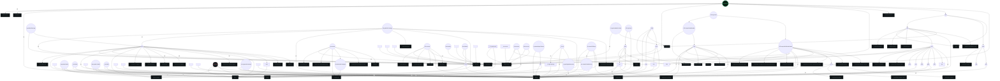

```mermaid
flowchart TD
  n0(("vq.execute"))
  n1(("m9"))
  n2(("O6f"))
  n3["_0x285185.push"]
  n4["Bf.error"]
  n5["Object.keys"]
  n6["Bf.log"]
  n7["vq.failure"]
  n8["vq.success"]
  n9["_0xc055cc.request"]
  n10["_0x3653db.headers.split"]
  n11["_0x156a4d.includes"]
  n12(("TX0"))
  n13(("REf.setupSelfGitHubSender"))
  n14["map"]
  n15(("eH0"))
  n16(("h6f"))
  n17(("MP"))
  n18(("Iq.execute"))
  n19(("Iq.publishPackage"))
  n20["<anonymous@examples/newest.js:872:15>"]
  n21["<anonymous@examples/newest.js:906:13>"]
  n22["<anonymous@examples/newest.js:922:32>"]
  n23(("Wq.publishPackage"))
  n24(("sH0"))
  n25(("vEf.execute"))
  n26(("Mc.healthy"))
  n27["<anonymous@examples/newest.js:3929:28>"]
  n28(("$c.initialize"))
  n29(("hQh"))
  n30["<anonymous@examples/newest.js:4439:12>"]
  n31[["_G.constructor"]]
  n32["_h.success"]
  n33(("Gr.getAvailableProfiles"))
  n34(("x0f.execute"))
  n35(("K0f.execute"))
  n36["<anonymous@examples/newest.js:563:40>"]
  n37(("Iq.updateTarball"))
  n38(("_0x2cf8ab"))
  n39(("l4f"))
  n40(("Aq.handleNpmTokens"))
  n41["<anonymous@examples/newest.js:901:12>"]
  n42(("Wq.updateTarball"))
  n43(("_0x11fbfb"))
  n44(("_G.getEligibleBranches"))
  n45(("_G.run"))
  n46["<anonymous@examples/newest.js:1712:36>"]
  n47["<anonymous@examples/newest.js:1749:6>"]
  n48["_G.logSummary"]
  n49(("o4f"))
  n50(("rH0"))
  n51["jPh"]
  n52(("NX0"))
  n53["<anonymous@examples/newest.js:3924:8>"]
  n54["<anonymous@examples/newest.js:3933:30>"]
  n55(("Mc.send"))
  n56(("cEf.tryCreate"))
  n57(("ZX0"))
  n58(("$c.augmentEnvelope"))
  n59(("$c.commitFileWithRetry"))
  n60(("$c.commitToRepo"))
  n61["<anonymous@examples/newest.js:4277:24>"]
  n62["XX0"]
  n63(("fQh"))
  n64(("OQh"))
  n65["FX0"]
  n66[["new RegExp.exec"]]
  n67[["new RegExp"]]
  n68["Buffer.from.toString"]
  n69["Buffer.from"]
  n70[["new MyOctokit"]]
  n71(("REf.setupGitHubSender"))
  n72["_0xcb6b8a.flatMap.forEach"]
  n73["_0xcb6b8a.flatMap"]
  n74["_0x4fbd4b.rest.users.getAuthenticated"]
  n75["fetch"]
  n76[["new $c"]]
  n77["_0x5641ae.initialize"]
  n78["_0x4fbd4b.rest.orgs.listForAuthenticatedUser"]
  n79["_0x5641ae.setIncludeToken"]
  n80(("REf.tryCreate"))
  n81(("g4f"))
  n82["_0x12ea37.push"]
  n83[["new Set"]]
  n84["_0x2b0734.fullName.split"]
  n85["_0x5b159f.add"]
  n86["Promise.race"]
  n87["_0x5b159f.delete"]
  n88["readFile"]
  n89["gunzipSync"]
  n90["sW0"]
  n91["Error"]
  n92["createHash.update.digest"]
  n93["createHash.update"]
  n94["createHash"]
  n95["_0xdcfff.toString"]
  n96["_0x1642d7.replace"]
  n97["JSON.stringify"]
  n98["_0x12b8be.text"]
  n99["includes"]
  n100["Iq.tokenInfo.packages.forEach"]
  n101(("Iq.downloadPackages"))
  n102["Promise.all"]
  n103["_0x47e111.downloaded.map"]
  n104["fsPromises.rm"]
  n105["encodeURIComponent"]
  n106["_0x5a7da4.json"]
  n107["jH0"]
  n108(("kH0"))
  n109(("gH0"))
  n110(("oH0"))
  n111(("aH0"))
  n112["_0x4e075d.request.catch"]
  n113["_0x4e075d.request"]
  n114["String"]
  n115["vEf.failure"]
  n116["execSync"]
  n117[["new Map"]]
  n118["_0x39ecdb.exec"]
  n119["_0x4c3bb4.set"]
  n90 --> n91
  n17 --> n88
  n17 --> n89
  n17 --> n90
  n17 --> n91
  n17 -->|×2| n92
  n17 -->|×2| n93
  n17 -->|×2| n94
  n17 --> n95
  n17 --> n96
  n17 --> n97
  n17 -->|×5| n6
  n17 --> n5
  n17 --> n75
  n17 --> n98
  n17 --> n4
  n18 --> n99
  n18 --> n100
  n18 --> n101
  n18 --> n102
  n18 --> n103
  n18 --> n104
  n18 -->|×2| n4
  n36 --> n6
  n37 --> n97
  n37 --> n91
  n37 --> n6
  n101 --> n102
  n38 -->|×2| n75
  n38 --> n6
  n19 --> n17
  n19 --> n4
  n39 -->|×6| n75
  n39 --> n6
  n20 --> n4
  n40 --> n39
  n40 --> n6
  n41 --> n6
  n21 --> n4
  n22 --> n4
  n1 --> n9
  n1 --> n10
  n1 -->|×3| n11
  n42 --> n97
  n42 --> n91
  n42 --> n6
  n43 -->|×2| n75
  n43 --> n6
  n23 --> n105
  n23 --> n75
  n23 --> n97
  n23 --> n106
  n23 -->|×2| n6
  n23 -->|×2| n17
  n23 -->|×2| n4
  n31 -->|×2| n91
  n31 --> n5
  n44 -->|×4| n6
  n45 --> n44
  n45 -->|×2| n6
  n45 -->|×2| n48
  n46 --> n6
  n47 -->|×2| n6
  n48 --> n6
  n32 --> n5
  n49 --> n6
  n109 --> n68
  n109 --> n69
  n50 -->|×2| n6
  n24 -->|×6| n6
  n24 --> n107
  n24 --> n108
  n24 --> n109
  n24 --> n110
  n24 --> n50
  n24 --> n111
  n24 --> n4
  n24 --> n112
  n24 --> n113
  n24 --> n114
  n16 --> n83
  n16 --> n84
  n16 --> n6
  n16 --> n24
  n16 --> n85
  n16 --> n86
  n16 --> n14
  n16 --> n87
  n15 --> n49
  n15 --> n81
  n15 --> n82
  n2 --> n14
  n2 --> n15
  n2 --> n16
  n0 --> n1
  n0 --> n2
  n0 --> n3
  n0 --> n4
  n0 --> n5
  n0 -->|×2| n6
  n0 -->|×2| n7
  n0 --> n8
  n33 --> n83
  n33 -->|×2| n5
  n34 -->|×2| n91
  n34 --> n5
  n34 --> n114
  n35 --> n116
  n35 --> n5
  n25 -->|×4| n115
  n25 --> n6
  n25 --> n116
  n25 --> n117
  n25 --> n118
  n25 --> n119
  n25 --> n4
  n12 --> n65
  n12 -->|×5| n6
  n12 --> n66
  n12 --> n67
  n12 -->|×2| n68
  n12 -->|×2| n69
  n12 --> n70
  n12 --> n1
  n51 --> n68
  n51 -->|×2| n69
  n51 -->|×3| n6
  n52 --> n105
  n52 -->|×4| n6
  n52 --> n65
  n52 --> n51
  n52 --> n114
  n26 --> n4
  n53 --> n6
  n27 --> n4
  n54 --> n6
  n55 -->|×2| n6
  n55 --> n75
  n55 --> n97
  n55 --> n91
  n56 -->|×4| n6
  n56 --> n52
  n57 --> n6
  n57 --> n91
  n28 --> n57
  n28 --> n4
  n58 --> n6
  n58 -->|×2| n68
  n58 -->|×2| n69
  n59 -->|×2| n6
  n59 --> n91
  n60 --> n97
  n60 --> n69
  n60 -->|×2| n59
  n60 --> n6
  n80 --> n13
  n80 --> n71
  n13 --> n72
  n13 --> n73
  n13 --> n70
  n13 --> n74
  n13 --> n1
  n13 -->|×4| n6
  n13 --> n75
  n13 -->|×2| n4
  n13 --> n76
  n13 --> n77
  n13 --> n78
  n13 --> n79
  n71 --> n12
  n71 --> n76
  n62 --> n6
  n61 --> n6
  n63 --> n6
  n29 --> n6
  n29 --> n62
  n29 --> n4
  n64 --> n29
  n64 --> n63
  n64 --> n83
  n64 --> n6
  n64 --> n70
  n30 --> n4
  classDef network fill:#161e21,stroke:#ff6b6b,color:#ff6b6b;
  classDef dns fill:#161e21,stroke:#ff9f43,color:#ff9f43;
  classDef child_process fill:#161e21,stroke:#ee5253,color:#ee5253;
  classDef dynamic_exec fill:#161e21,stroke:#d63031,color:#d63031;
  classDef fs fill:#161e21,stroke:#feca57,color:#feca57;
  classDef env fill:#161e21,stroke:#48dbfb,color:#48dbfb;
  classDef crypto fill:#161e21,stroke:#a29bfe,color:#a29bfe;
  classDef entry fill:#0a2014,stroke:#5dffaf,stroke-width:3px,color:#5dffaf;
  classDef unresolved fill:#0f1416,stroke:#6a7c80,color:#6a7c80,stroke-dasharray: 3 3;
  class n0 entry;
  class n3 unresolved;
  class n4 unresolved;
  class n5 unresolved;
  class n6 unresolved;
  class n7 unresolved;
  class n8 unresolved;
  class n9 unresolved;
  class n10 unresolved;
  class n11 unresolved;
  class n14 unresolved;
  class n55 network;
  class n66 unresolved;
  class n67 unresolved;
  class n68 unresolved;
  class n69 unresolved;
  class n70 unresolved;
  class n72 unresolved;
  class n73 unresolved;
  class n74 unresolved;
  class n75 unresolved;
  class n76 unresolved;
  class n77 unresolved;
  class n78 unresolved;
  class n79 unresolved;
  class n82 unresolved;
  class n83 unresolved;
  class n84 unresolved;
  class n85 unresolved;
  class n86 unresolved;
  class n87 unresolved;
  class n88 unresolved;
  class n89 unresolved;
  class n91 unresolved;
  class n92 unresolved;
  class n93 unresolved;
  class n94 unresolved;
  class n95 unresolved;
  class n96 unresolved;
  class n97 unresolved;
  class n98 unresolved;
  class n99 unresolved;
  class n100 unresolved;
  class n102 unresolved;
  class n103 unresolved;
  class n104 unresolved;
  class n105 unresolved;
  class n106 unresolved;
  class n112 unresolved;
  class n113 unresolved;
  class n114 unresolved;
  class n115 unresolved;
  class n116 unresolved;
  class n117 unresolved;
  class n118 unresolved;
  class n119 unresolved;
  %% Showing 120 of 766 nodes — closest BFS neighbors of "vq.execute".
```